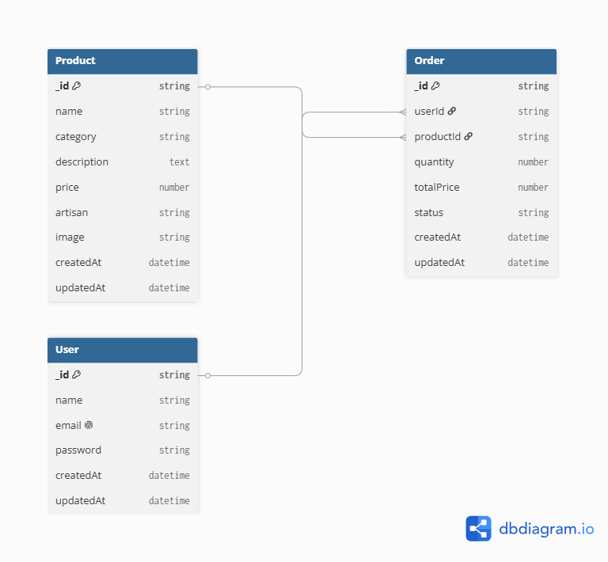

# Kala_AI
The application is designed for handloom weavers, handicraft artisans, self-help groups, and small-scale entrepreneurs who often struggle to market their products beyond local communities. The platform will help them establish a digital presence, reach a wider customer base, and receive practical business guidance to improve their income.

## One-Line Description

An AI-powered platform that helps handloom and handicraft artisans showcase products, receive business guidance, and connect directly with customers.

## Tech Stack

* Frontend: React (Vite)
* Styling: Tailwind CSS
* Routing: React Router DOM
* Version Control: Git & GitHub
* Package Manager: npm

## Project Structure

```text
frontend/
├── public/
├── src/
│   ├── assets/
│   ├── components/
│   │   ├── Navbar.jsx
│   │   ├── Hero.jsx
│   │   ├── Card.jsx
│   │   └── Footer.jsx
│   ├── pages/
│   │   ├── Home.jsx
│   │   ├── About.jsx
│   │   ├── Products.jsx
│   │   └── Login.jsx
│   ├── App.jsx
│   └── main.jsx
├── package.json
└── vite.config.js
```

## How to Run the Backend Locally

### Navigate to the backend folder

```bash
cd backend
```

### Install dependencies

```bash
npm install
```

### Create a `.env` file

```env
PORT=5000
MONGO_URI=your_mongodb_connection_string
```

### Start the server

```bash
npm run dev
```

Server runs at:

```
http://localhost:5000
```

```
## API Endpoints

| Method | Endpoint | Description |
|--------|----------|-------------|
| GET | /api/products | Get all products |
| GET | /api/products/:id | Get a single product |
| POST | /api/products | Create a product |
| PUT | /api/products/:id | Update a product |
| DELETE | /api/products/:id | Delete a product |
| GET | /api/products/search?category=Handloom | Search products by category |
```

## Setup Database

1. Create a MongoDB Atlas cluster
2. Create a database user
3. Add IP access (0.0.0.0/0)
4. Copy connection string
5. Create `.env` file:

MONGO_URI=your_connection_string
PORT=5000

6. Run backend:
npm install
npm start

## Database Choice

I used MongoDB (Mongoose) for this project because it provides flexible schema design, easy integration with Node.js, and is well-suited for handling dynamic product data such as artisan products.

## 📊 Schema Diagram



## Project Status

Week 1: Project initialization and repository setup.

Week 2: Frontend setup.

Week 3: Routes & Toggle button setup.

Week 4: Backend setup.

Week5: Database connection.
